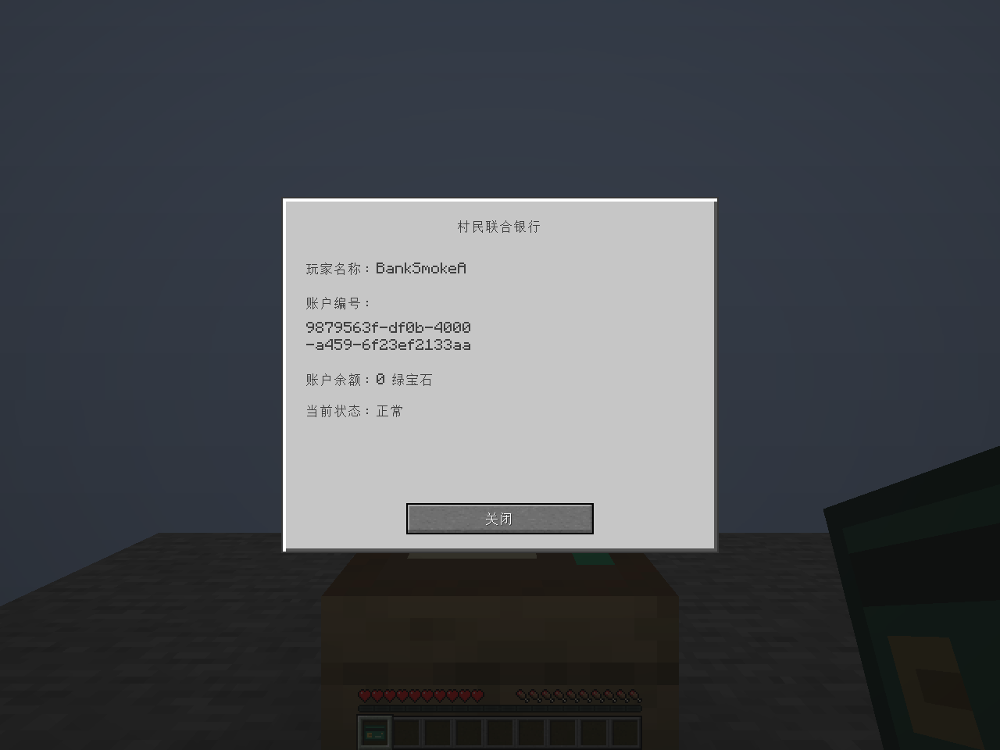
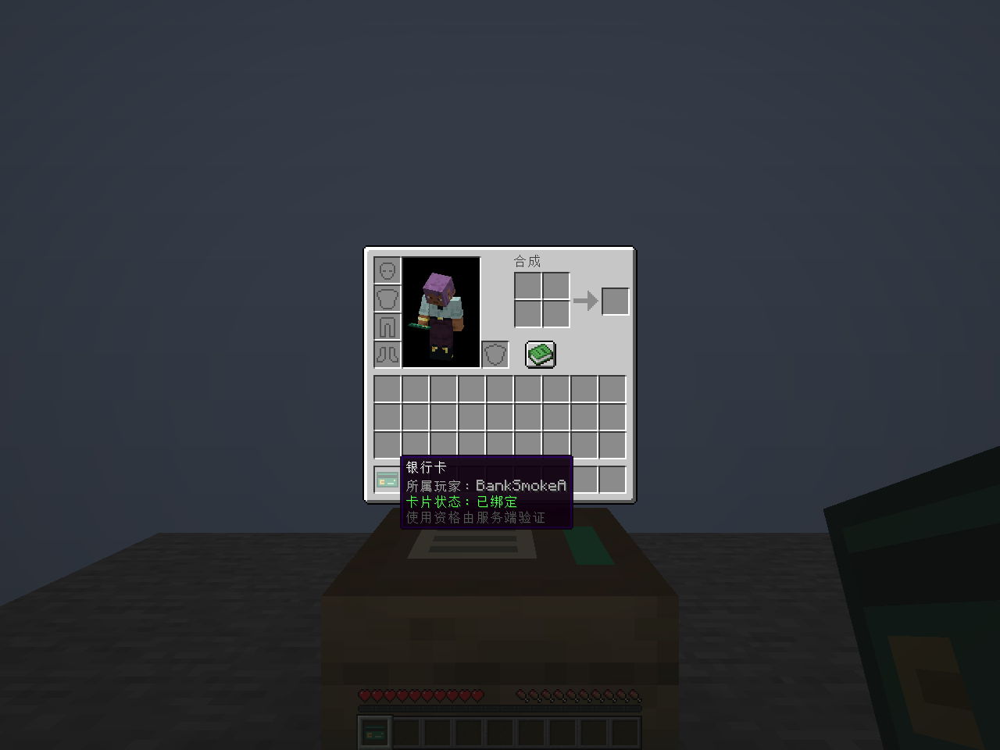

# The Last Bet / 最后一注

一个旨在揭示赌博风险的 Minecraft Java Edition 模组。本仓库当前只实现**第一阶段：银行开户系统**。

| 项目 | 版本 / 标识 |
| --- | --- |
| 模组 | 1.0.0 |
| Minecraft | 1.21.1 |
| 加载器 | Fabric Loader 0.19.5 或以上 |
| Fabric API | 0.116.17+1.21.1 |
| Java（构建和游戏） | 21 |
| 构建链 | Gradle 8.14.3 / Fabric Loom 1.11.8 |
| 映射 | Mojang Mappings |
| Mod ID / 包名 | `lastbet` / `com.shouyun.lastbet` |

## 第一阶段功能

- 银行柜台：四个水平方向放置、旋转、正常破坏和掉落；创造模式“功能性方块”栏可取得。
- 右键柜台进入“村民联合银行”，支持简体中文和英文，以及未开户、已开户和服务停用页面。
- 每个玩家 UUID 仅有一个个人账户，独立账户编号，初始余额为 **0 绿宝石**。
- 开户成功发放一张不可堆叠的银行卡，带自定义纹理、所属玩家提示和独立卡片编号。
- 开户、身份校验、卡片验证和数据保存由服务端完成，客户端仅发送开户意图。
- 背包满时暂缓开户，腾出一个主背包格后重试；待发卡恢复沿用原账户和卡片编号。
- 数据保存在主世界 `data/lastbet_bank.dat`，跨维度共享，死亡和退出不会删除账户。
- 写入经过临时文件、压缩 NBT 回读校验和安全替换；上一版本保存在 `lastbet_bank.dat_old`。
- 数据损坏或保存失败时停用银行，保留文件并记录明确错误，世界继续运行。

本阶段没有存取款、银行卡支付、补卡、贷款、抵押、赌博设备、赌场或负面效果。柜台没有合成配方或自然生成；银行卡不能通过普通合成制造有效凭证，普通无绑定卡也不能创建账户。

## 使用

1. 在客户端与服务器的 `mods` 目录安装 Fabric API 和构建出的 `lastbet-1.0.0.jar`。
2. 用创造模式在“功能性方块”栏搜索“银行柜台”，放置后右键。
3. 首次使用点击“开设账户”，开户免费，余额为 0；背包需有一个空格。
4. 再次右键显示账户编号、玩家名称、余额和状态。
5. 银行卡遵循原版死亡掉落规则。卡片丢失不会删除账户，本阶段不提供补卡。




## 构建与测试

安装 JDK 21 并设置 `JAVA_HOME` 后，在项目根目录执行：

```powershell
.\gradlew.bat build
```

Linux / macOS 使用 `./gradlew build`。产物位于 `build/libs/`；安装不带 `-sources` 后缀的 JAR。

`build` 自动运行 JUnit 和独立的服务端 GameTest。可分别运行：

```powershell
.\gradlew.bat test
.\gradlew.bat runGametest
.\gradlew.bat runClient
.\gradlew.bat runServer
```

报告：`build/reports/tests/test/index.html` 和 `build/gametest/reports/bank-gametest.xml`。

真实客户端联网冒烟测试使用独立测试模组和存档，全部位于 `build/`，不会进入发布 JAR。准备后，在不同终端分别运行：

```powershell
powershell -ExecutionPolicy Bypass -File tools/prepare_smoke.ps1
.\gradlew.bat runSmokeServer --no-configuration-cache
# 保持服务器运行，在另外的终端分别执行：
.\gradlew.bat runClientSmokeA
.\gradlew.bat runClientSmokeB
```

测试服务器只监听 `127.0.0.1:25589`。客户端自动检查开户、重复请求、背包满、界面缩放和死亡，并输出截图及 JSON 结果。正常关闭服务器后再次启动并重跑两个客户端，会核对重启前后的账户编号和余额。结果及完整测试边界见 [验证记录](docs/verification.md)。

## 数据维护与扩展

银行服务停用时，先关闭世界或服务器并备份存档，检查日志中的具体路径与异常。核实备份后恢复 `lastbet_bank.dat`，再重新加载世界。程序不会自动以空数据替换损坏文件，也不会自动覆盖存在的备份来重建账户。

核心入口为 `BankManager`，提供按所有者 UUID / 账户编号查询以及持卡人验证。`BankAccount` 是不可变视图，余额使用整颗绿宝石的非负 `long`；当前没有公开余额修改接口。`BankSavedData` 使用带版本的原生世界持久化，为后续经济功能留出扩展位置。

## 许可证

本项目使用 [MIT License](LICENSE)，保留远程仓库原有版权与许可证文本。原 Fabric 模板的 CC0 文本保留在 [LICENSE.template-CC0](LICENSE.template-CC0)。
