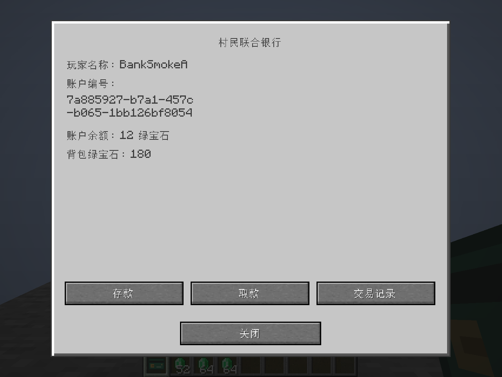
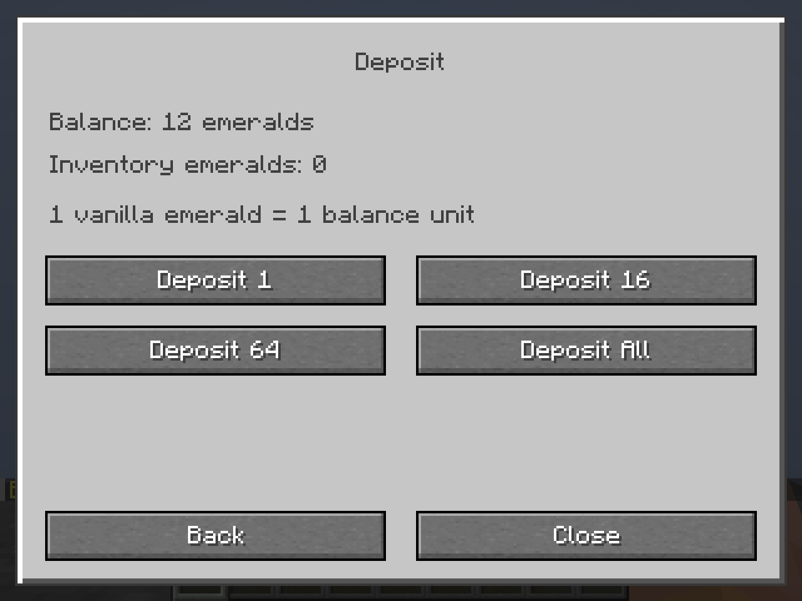
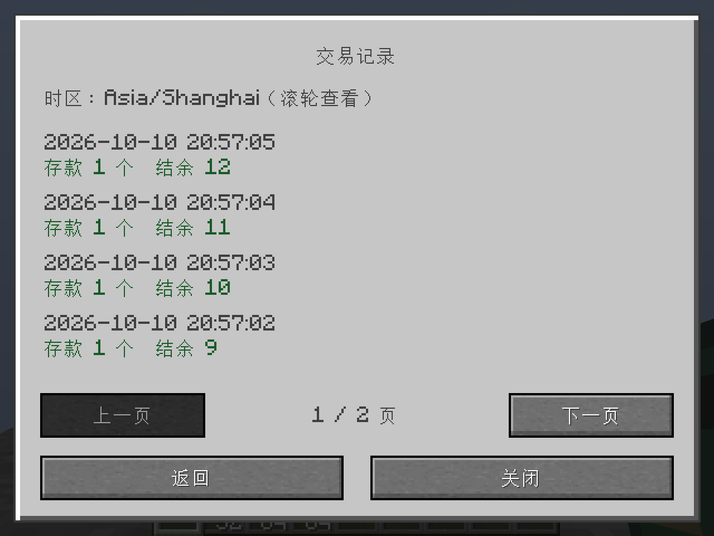

# The Last Bet / 最后一注

一个旨在揭示赌博风险的 Minecraft Java Edition 模组。本仓库已实现**银行开户，以及第二阶段的绿宝石存取款与交易流水**。

| 项目 | 版本 / 标识 |
| --- | --- |
| 模组 | 1.0.0 |
| Minecraft | 1.21.1 |
| 加载器 | Fabric Loader 0.19.5 或以上 |
| Fabric API | 0.116.17+1.21.1 |
| Java（构建和游戏） | 21 |
| 构建链 | Gradle 8.14.3 / Fabric Loom 1.11.8 |
| 映射 | Mojang Mappings |
| Mod ID / 包名 | `lastbet` / `com.shouyun.lastbet` |

## 第一阶段功能

- 银行柜台：四个水平方向放置、旋转、正常破坏和掉落；创造模式“功能性方块”栏可取得。
- 右键柜台进入“村民联合银行”，支持简体中文和英文，以及未开户、已开户和服务停用页面。
- 每个玩家 UUID 仅有一个个人账户，独立账户编号，初始余额为 **0 绿宝石**。
- 开户成功发放一张不可堆叠的银行卡，带自定义纹理、所属玩家提示和独立卡片编号。
- 开户、身份校验、卡片验证和数据保存由服务端完成，客户端仅发送开户意图。
- 背包满时暂缓开户，腾出一个主背包格后重试；待发卡恢复沿用原账户和卡片编号。
- 数据保存在主世界 `data/lastbet_bank.dat`，跨维度共享，死亡和退出不会删除账户。
- 写入经过临时文件、压缩 NBT 回读校验和安全替换；上一版本保存在 `lastbet_bank.dat_old`。
- 数据损坏或保存失败时停用银行，保留文件并记录明确错误，世界继续运行。

## 第二阶段功能

- **1 个原版绿宝石 = 1 单位余额**。存款、取款均支持 1、16、64、全部；只使用主背包与快捷栏的 36 格。
- 存款数量不足时整笔拒绝；取款先计算完整容量，优先合并组件兼容的堆叠，空间不足时整笔拒绝，不落地、不透支。
- 已开户后可直接使用本人账户，无需随身携带银行卡。副手、盔甲、绿宝石块和容器中的物品不参与交易。
- 账户首页、存款页、取款页、流水页分别显示；操作后同步刷新余额与背包数量。支持中英文、GUI 缩放 2 / 3 / 4 和流水滚动。
- 每笔成功流水保存交易 UUID、账户 / 玩家 UUID、类型、数量、结余、服务端时间与顺序号。最新优先，每页 10 笔，可翻页，完整历史持续保留。
- 服务端校验柜台、距离、菜单会话和一次性令牌；关闭界面、死亡、远离柜台及重复提交不能额外结算。
- 独立预写日志、玩家文件检查点和银行文件检查点支持跨文件幂等恢复；不确定状态暂停账户并断开玩家，保留证据。
- 第一阶段合法 schema 1 存档显式升级至 schema 2，保留所有余额、账户、卡片及所有者标识，旧账户流水初始化为空。

当前没有银行卡支付、补卡、ATM、贷款、利息、抵押、转账、其他贵重物品兑换、赌博设备、赌场或负面效果。柜台没有合成配方或自然生成；银行卡不能通过普通合成制造有效凭证，普通无绑定卡也不能创建账户。

## 使用

1. 在客户端与服务器的 `mods` 目录安装 Fabric API 和构建出的 `lastbet-1.0.0.jar`。
2. 用创造模式在“功能性方块”栏搜索“银行柜台”，放置后右键。
3. 首次使用点击“开设账户”，开户免费，余额为 0；背包需有一个空格。
4. 再次右键查看账户编号、玩家名称、余额与可用绿宝石，选择“存款”或“取款”，再选择数量。
5. 选择“交易记录”查看最近 10 笔；上一页 / 下一页可查看完整历史。较矮窗口用滚轮查看当前页，时间按客户端本地时区显示。
6. 银行卡遵循原版死亡掉落规则。卡片丢失不会删除账户或限制存取款，本阶段不提供补卡。






## 构建与测试

安装 JDK 21 并设置 `JAVA_HOME` 后，在项目根目录执行：

```powershell
.\gradlew.bat build
```

Linux / macOS 使用 `./gradlew build`。产物位于 `build/libs/`；安装不带 `-sources` 后缀的 JAR。

`build` 自动运行 JUnit 和独立的服务端 GameTest。可分别运行：

```powershell
.\gradlew.bat test
.\gradlew.bat runGametest
.\gradlew.bat runClient
.\gradlew.bat runServer
```

报告：`build/reports/tests/test/index.html` 和 `build/gametest/reports/bank-gametest.xml`。

真实客户端联网冒烟测试使用独立测试模组和存档，全部位于 `build/`，不会进入发布 JAR。准备后，在不同终端分别运行：

```powershell
powershell -ExecutionPolicy Bypass -File tools/prepare_smoke.ps1
.\gradlew.bat runSmokeServer --no-configuration-cache
# 保持服务器运行，在另外的终端分别执行：
.\gradlew.bat runClientSmokeA
.\gradlew.bat runClientSmokeB
```

测试服务器只监听 `127.0.0.1:25589`。客户端自动检查开户、八种存取款、重复提交、刷新、流水分页、中英文、界面缩放和死亡，并输出截图及 JSON 结果。正常关闭服务器后再次启动并重跑两个客户端，会核对非零余额、绿宝石、全部流水及原标识。第二阶段使用 `build/phase2-*`，保留原第一阶段测试世界。

真实进程强制终止测试（8 个阶段，每次重新启动 JVM 读取磁盘）：

```powershell
powershell -ExecutionPolicy Bypass -File tools/run_crash_recovery.ps1
```

该脚本保留每个 `build/crash-*` 世界和结果，已有测试世界时拒绝覆盖。单人重载、损坏保护的复现条件及实际结果见 [验证记录](docs/verification.md)。

## 数据维护与扩展

银行服务停用或账户被锁定时，先关闭世界或服务器并备份**整个世界**，检查日志中的路径、交易 UUID 和异常。银行、玩家与事务日志必须一致恢复，不能单独回滚银行文件。程序不会猜测恢复、自动采用旧备份或清零账户。详细格式、提交顺序、管理员处理和容量限制见 [事务说明](docs/transactions.md)。

核心入口为 `BankManager`，提供账户查询、持卡人验证与服务端交易校验。`BankAccount` 是不可变视图，余额使用整颗绿宝石的非负 `long`。`BankSavedData` 保存 schema 2 账户及完整流水；`BankTransactions` 协调玩家与银行文件。达到现有 64 MiB NBT 读取分配预算前拒绝新交易并提示，历史不会静默覆盖。大规模服务器需后续增加分段持久化；本阶段采用同步落盘，交易可能短暂阻塞服务端主线程。

## 许可证

本项目使用 [MIT License](LICENSE)，保留远程仓库原有版权与许可证文本。
