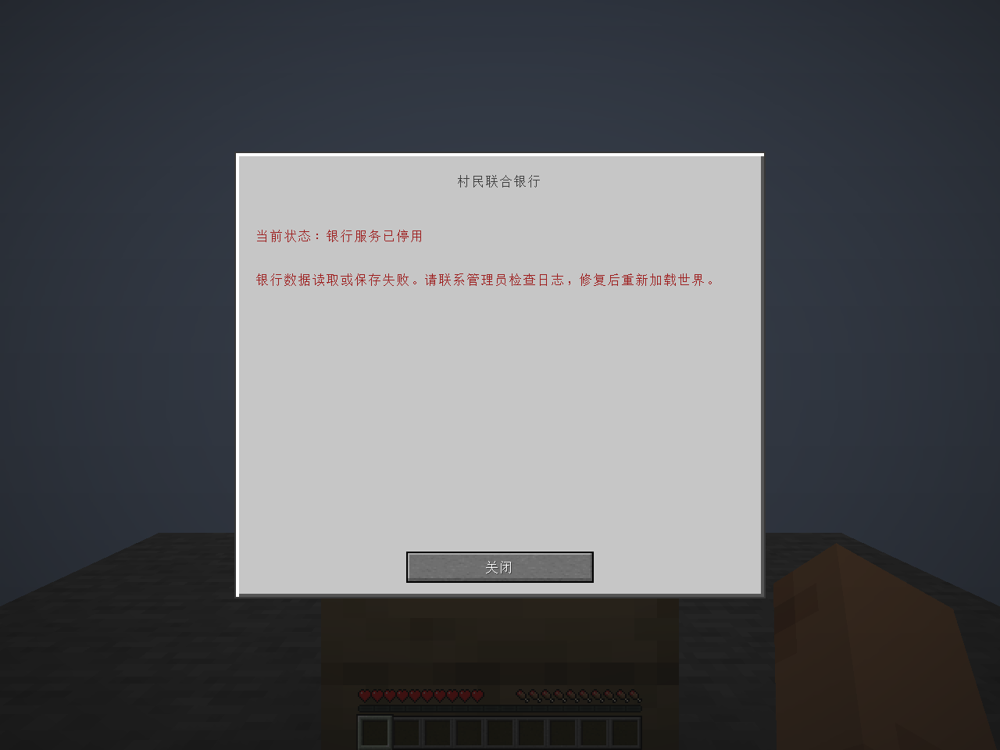
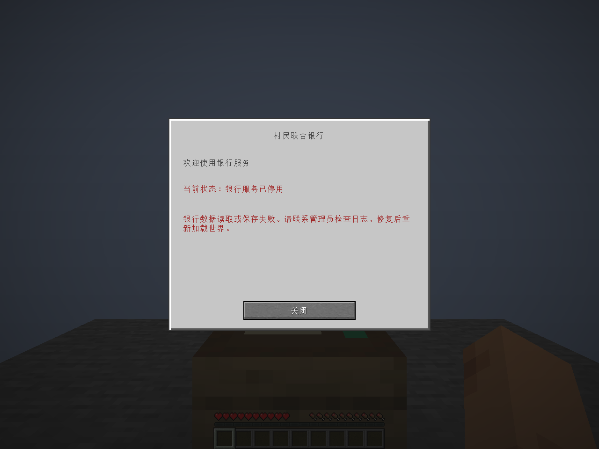

# 银行功能验证记录

## 第二阶段：2026-10-10

环境沿用下方第一阶段记录，未升级 Gradle、映射、Java、Minecraft 或 Fabric 依赖。第一阶段的 15 项 JUnit / 10 项 GameTest 结果只作为基线，第二阶段重新运行全部验证。所有破坏性测试只操作 `build/` 中的隔离世界，未修改用户游戏存档。

### 构建与自动化结果

最终执行 `gradlew.bat build --rerun-tasks --no-configuration-cache`，**BUILD SUCCESSFUL，18 个任务全部执行**。

| 项目 | 实际结果与覆盖 |
| --- | --- |
| JUnit | **21 / 21 通过**：原 15 项回归 + 6 项流水 / 迁移测试，覆盖非零 v1 余额及全部标识保存重载、唯一 UUID / 幂等提交、时钟回拨顺序、35 笔完整历史、余额边界、非法流水及检查点 |
| GameTest | **23 / 23 通过**：原 10 项回归 + 13 项交易测试，覆盖八种存取款、资产守恒、失败不记流水、容量不足、组件兼容堆叠、副手 / 盔甲 / 方块 / 钻石 / 装有绿宝石的潜影盒排除、多玩家隔离、伪造菜单 / 会话 / 令牌、重复提交、错误页面、关闭 / 距离 / 柜台移除 / 死亡 / 旁观者、分页与重生检查点 |
| 可控异常 | 8 个提交边界 × 存款 / 取款，共 **16 种场景通过**；每种丢弃内存，从真实文件重载并再次恢复，验证守恒和唯一流水 |
| 恢复异常 | 恢复再次中断后重启完成；实际银行写入 IOException 全局停用且旧文件不变；损坏日志、冲突检查点及玩家主文件缺失保留证据并锁定，禁止旧备份回退 |
| 发布 JAR | **通过**：82 个条目、Java class 版本 65、MIT 许可证；55 个语言键中英文一致；无测试类、测试模组元数据、存档、日志、事务文件或故障控制属性 |

实际 GameTest 故障注入日志中出现的错误是负向场景预期，不计为测试失败。单元报告位于 `build/reports/tests/test/index.html`；GameTest XML 位于 `build/gametest/reports/bank-gametest.xml`；最终构建日志为 `build/phase2-final-build.local.log`。

### 两个真实客户端及专用服务器重启

`runSmokeServer` 与 `runClientSmokeA` / `runClientSmokeB` 实际联网，使用 `build/phase2-smoke-server/world` 和两个独立客户端目录。A 使用简体中文，B 使用英文；测试调用实际页面按钮及 Fabric 请求载荷。

- 两人分别完成开户和全部八种操作，数量不足 / 余额不足明确拒绝，操作后余额与物品刷新；B 的满背包开户回归仍通过。
- 快速二次按钮操作及同一令牌的原始请求，只结算一次。
- 每人最终成功流水 20 笔，客户端读取两页，核对全部唯一 UUID 和最新优先顺序；没有互相影响账户。
- B 实际死亡并重生后，余额保持 12、流水 20 笔。测试夹具清理 B 的死亡掉落以避免复活拾回，所以 B 背包绿宝石为 0；这不计入正常交易守恒检查。
- 正常停服并启动新专用服务器 JVM，两客户端重新连接后核对非零余额、背包数量、账户 UUID 与全部 20 笔流水 UUID；A 的随身银行卡 UUID 保持不变。另直接解压停服后的银行 NBT，核对 A / B 的所有者、账户和卡片 UUID 均未变化。
- 四个页面 × 三种缩放 × 两种语言共 **24 张截图已检查**；按钮处于窗口内，流水有清晰日期时间及时区、翻页和滚动。另保存缩放 4 的滚动截图。

| 玩家 | 所有者 UUID | 账户 UUID | 银行卡 UUID | 重启后余额 / 背包绿宝石 / 流水 |
| --- | --- | --- | --- | --- |
| BankSmokeA | `1669cafd-9a81-30a9-9064-8a6489729ddc` | `7a885927-b7a1-457c-b065-1bb126bf8054` | `917cbc75-5951-4f2a-b517-7fb65156a39c` | 12 / 180 / 20 |
| BankSmokeB | `117f1066-1d21-3c1e-9833-c87cf54b3570` | `2b627cc7-e5f9-4c1e-a745-b145926f5ae9` | `ed5860a5-95df-4a39-a45f-68736a5eb480` | 12 / 0 / 20 |

证据：`build/phase2-client-smoke-{a,b}/phase2-initial.json`、`phase2-reloaded.json`、`screenshots/`，以及 `build/phase2-bank-identities.json`。第一阶段世界及其原标识记录另行保留，没有用第二阶段夹具覆盖。

### 真实进程强制终止

执行 `tools/run_crash_recovery.ps1`，对每一阶段启动独立专用服务器，在指定持久化边界 `Runtime.halt(86)`，不执行服务器正常保存；然后启动全新 JVM，从该世界的实际磁盘文件恢复。故障入口仅存在于测试源集。

| 强制终止点 | 恢复余额 | 恢复背包绿宝石 | 流水数 | 结果 |
| --- | --- | --- | --- | --- |
| PREPARE_BEFORE | 0 | 64 | 0 | 通过；尚未建立事务，无资产变更 |
| PREPARE_AFTER | 16 | 48 | 1 | 通过 |
| PLAYER_BEFORE | 16 | 48 | 1 | 通过 |
| PLAYER_AFTER | 16 | 48 | 1 | 通过 |
| BANK_BEFORE | 16 | 48 | 1 | 通过 |
| BANK_AFTER | 16 | 48 | 1 | 通过 |
| COMPLETE_BEFORE | 16 | 48 | 1 | 通过 |
| COMPLETE_AFTER | 16 | 48 | 1 | 通过 |

每例保留在 `build/crash-<阶段>/`，汇总为 `build/crash-recovery-results.json`。强制终止阶段的 Gradle 非零退出是脚本明确验证的预期退出码 86；恢复阶段全部正常成功。真实 JVM 终止使用存款 16 场景，取款的各边界由上述 16 场景的磁盘异常注入覆盖。

### 单人整合服务器重载

真实客户端打开专用测试世界的**副本**，新所有者开户，64 个绿宝石存入 16 个；正常退出世界后，测试明确将副本 `level.dat.Data.Player` 改为交易前快照，再重新进入。实际结果：**余额 16、背包 48、唯一流水 1，账户及卡片 UUID 不变**。说明入服加载经过校验的 `playerdata` 主文件，没有被旧的单人快照覆盖。

证据：`build/phase2-singleplayer-client/singleplayer-passed.json` 与 `build/phase2-singleplayer-final.local.log`。

首次脚本遗漏先断开本地世界连接，退出卡住；修正测试脚本后的一次重试又因旧夹具残留账户而失败。两次都未计为通过，日志及失败世界保留。用新的隔离副本最终重测通过。Gradle 单人任务已增加失败 / 完成报告检查。

复现条件：先正常停止测试服务器，将其世界复制到 `build/phase2-singleplayer-client/saves/phase2-singleplayer`，再运行 `gradlew.bat runClientSmokeSingleplayer --no-configuration-cache`。该测试要求副本中尚无 `BankSingleplayer` 所有者账户；重复测试前应显式归档整个旧副本，禁止将新旧世界合并。客户端选项可沿用 `tools/prepare_smoke.ps1` 生成的测试选项。

### 银行损坏保护

停止第二阶段专用服务器，保存有效主文件及备份，在隔离世界中将银行主文件替换为 5 字节截断 gzip。`runClientSmokeUnavailable` 真实入服后验证只有关闭按钮、银行停用、伪造存款请求不能执行，世界继续运行。正常停服后损坏文件 SHA-256 仍为：

`8AB6AD314F25BA95E02C5F92DBE6A01DDF12CA3F25122E8EE47AB366DEB35213`

恢复测试前的有效主文件及备份后再次启动，A 真实客户端核对余额 12、背包 180 和完整 20 笔流水，全部通过。证据保存在 `build/phase2-corruption-evidence/`、`build/phase2-corruption-*.local.log`、`build/phase2-restored-client.local.log`。此处测试期间银行未发生交易，恢复的是同一停服快照；正式维护仍须遵循[完整世界一致恢复规则](transactions.md)。

### 未执行与剩余限制

- 未测试操作系统断电、硬盘物理损坏、所有文件系统对原子替换的实现。JVM 强制终止不能证明上述场景。
- 未测试公网、正版账号认证、多台机器或第三方模组组合。实际联网为本机回环离线测试服。
- 未做大量账户 / 海量流水 / 慢磁盘性能基准；同步落盘会阻塞主线程，完整日志持续增长，现有 64 MiB NBT 分配预算限制保留并提前拒绝超限交易。
- 不支持外部程序或第三方模组直接修改资产、运行中替换文件、部分存档回滚；发现不一致锁定，需管理员核对证据。

测试存档、构建缓存、失败日志和临时脚本均位于忽略的 `build/`，不提交 Git。第二阶段到此为止，没有开始贷款、转账或其他第三阶段功能。

---

# 第一阶段验证记录（原始记录保留）

验证日期：2026-10-10（Asia/Shanghai）。环境：Windows 11、Microsoft OpenJDK 21.0.8、Minecraft 1.21.1、Fabric Loader 0.19.5、Fabric API 0.116.17+1.21.1、Loom 1.11.8、Gradle 8.14.3。

## 自动化验证

`gradlew.bat build` 包含 JUnit 和服务端 GameTest，任何失败都会使构建失败。

| 测试 | 覆盖内容 |
| --- | --- |
| JUnit（15 项） | 单一账户、不同玩家隔离、初始余额、凭证三重匹配、发卡状态、压缩 NBT 与备份回读、损坏字段及重复标识、保存失败停用、截断文件、主文件丢失但备份存在 |
| GameTest（10 项） | 原生 BlockItem 四向放置、旋转与掉落、开户发卡、重复请求、背包满、无效菜单 / 操作 / 距离 / 柜台、不同玩家与伪造卡片、死亡保留、真实磁盘回读、待发卡及已入包状态恢复、死亡 / 旁观者请求拒绝 |

测试源集与测试模组元数据独立；发布 JAR 仅包含主代码、客户端代码和生产资源。

## 真实客户端和专用服务器

使用隔离世界 `build/smoke-server/world` 和两个独立客户端目录，通过原版菜单交互与 Fabric 开屏协议实际联网；不是仅构造页面预览。

- 两个客户端均正常启动和接入服务器，柜台右键打开银行页面。
- `BankSmokeA` 完成首次开户，获得一张绑定自己的银行卡，余额为 0。
- `BankSmokeB` 的主背包填满后开户被拒绝，未生成账户；腾出空间后开户成功。
- 已开户后再次发送开户按钮请求，账户编号不变、没有多发卡。
- 实际“关闭”按钮关闭菜单，再次右键仍显示原账户。
- `BankSmokeB` 被杀死并重生后，再次右键仍显示原账户及 0 余额。
- 正常关闭并完整重启同一专用服务器，两个客户端退出重进后均核对账户编号不变；A 的银行卡仍在背包且卡片编号不变。
- GUI 缩放 2、3、4 的中文页面已截图并人工检查；银行卡实际物品纹理、所属玩家和绑定状态提示已检查。
- 专用服务端正常加载生产公共代码，未出现客户端渲染类加载崩溃。
- 恢复有效文件后再次重启，两个真实客户端同时在线并分别核对账户；服务端日志记录 00:16:05 至 00:16:10 两人同时在服，账户仍各自独立。

重启前后的真实测试标识：

| 玩家 | 所有者 UUID | 账户 UUID | 卡片 UUID |
| --- | --- | --- | --- |
| BankSmokeA | `1669cafd-9a81-30a9-9064-8a6489729ddc` | `9879563f-df0b-4000-a459-6f23ef2133aa` | `045b5992-7070-4613-b371-a269507415b6` |
| BankSmokeB | `117f1066-1d21-3c1e-9833-c87cf54b3570` | `f1f04c3f-08e0-4d46-814e-71b3c5ace5a9` | `ba80140f-0572-45fb-854b-ef1ee9f52d1b` |

本地证据保存在 `build/client-smoke-{a,b}/smoke-initial.json`、`smoke-reloaded.json`、`screenshots/` 及客户端 / 服务器日志。开发存档、缓存和日志不纳入版本控制。

## 损坏保护实测

仅在隔离测试世界中，停止服务器并备份有效银行文件后，将银行主文件替换为截断的 gzip 内容。

1. 专用服务器仍正常启动，日志明确记录读取失败和银行停用。
2. 真实客户端进入该世界并右键柜台，看到服务停用说明，只有关闭按钮。
3. 额外发送开户请求后，银行仍保持停用。
4. 停服后比较 SHA-256，损坏文件与测试前完全一致，没有被空账户文件覆盖。
5. 保留故障证据并恢复原有效银行文件。
6. 重新启动服务器后，两个真实客户端均再次验证原账户可读，银行服务恢复。

## 验证边界

- 完整退出重载使用专用服务器完成，未单独重复单人整合服务器的世界保存菜单流程。
- 真实联网使用本机回环地址的离线测试服务器；未验证公网连接、正版账号认证流程或第三方模组组合。
- 临时文件、失败注入、发卡恢复状态已测试；未模拟操作系统断电或硬盘物理损坏。

这些边界不计为已通过的额外测试。第一阶段没有实现支付、存取款、贷款、抵押或赌博系统。
